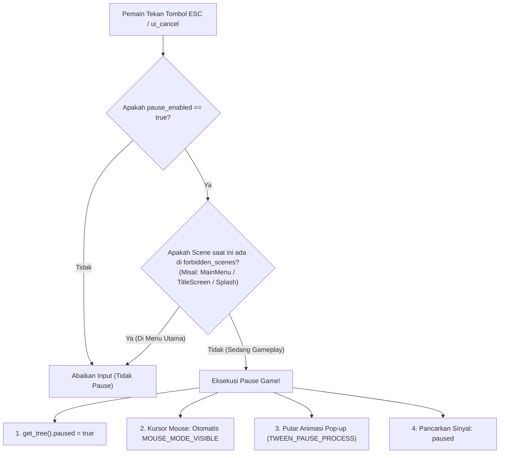

# 📖 Dokumentasi Resmi EasyPause (Godot 4.x)

Selamat datang di dokumentasi **EasyPause**! Addon ini dirancang dengan standar Godot 4.x untuk menyediakan **Pause Menu universal, modular, dan siap pakai** (*plug-and-play*). 

Addon ini memecahkan berbagai "jebakan klasik" sistem pause di Godot: **UI membeku saat dipause, kursor mouse terkunci di game 3D/FPS, animasi macet, serta pause yang tidak sengaja muncul di Menu Utama**.

---

## 📑 Daftar Isi
1. [Konsep Dasar & Masalah Pause di Godot](#1-konsep-dasar--masalah-pause-di-godot)
2. [Instalasi & 2 Cara Penggunaan](#2-instalasi--2-cara-penggunaan)
   - [Metode A: Global Autoload (Cukup Sekali Setting untuk Semua Level)](#metode-a-global-autoload-paling-direkomendasikan-)
   - [Metode B: Per-Scene Drop-in (Lokal di Scene Tertentu)](#metode-b-per-scene-drop-in-lokal-di-scene-tertentu)
3. [Panduan Mendalam: Pencegah Pause di Menu Utama](#3-panduan-mendalam-pencegah-pause-di-menu-utama)
   - [Mengapa Pencegah Ini Sangat Penting?](#mengapa-pencegah-ini-sangat-penting)
   - [Cara Kerja Deteksi Otomatis](#cara-kerja-deteksi-otomatis)
   - [Pilihan Cara Mengaturnya (Inspector vs Skrip)](#pilihan-cara-mengaturnya)
   - [Mematikan Pause Saat Cutscene / Dialog](#mematikan-pause-saat-cutscene--dialog-pause_enabled)
4. [Auto Mouse Management (Game 3D & FPS)](#4-auto-mouse-management-game-3d--fps)
5. [Animasi Tween Anti-Freeze](#5-animasi-tween-anti-freeze)
6. [Integrasi Save System](#6-integrasi-save-system)
7. [Referensi Class (API Reference)](#7-referensi-class-api-reference)
   - [Properties](#properties)
   - [Methods](#methods)
   - [Signals](#signals)
8. [FAQ & Solusi Masalah Umum](#8-faq--solusi-masalah-umum)

---

## 1. Konsep Dasar & Masalah Pause di Godot

Saat kamu memanggil `get_tree().paused = true`, seluruh Scene Tree di Godot akan membeku. Di sinilah banyak masalah sering muncul jika membuat pause menu secara manual:



EasyPause menangani seluruh siklus di atas secara otomatis sehingga kamu tidak perlu menulis logika rumit berulang kali di setiap project.

---

## 2. Instalasi & 2 Cara Penggunaan

### Langkah Instalasi:
1. Salin folder `addons/easy_pause/` ke dalam folder `addons/` di project Godot kamu:
   ```text
   res://
   └── addons/
       └── easy_pause/
           ├── plugin.cfg
           ├── plugin.gd
           ├── pause_menu.tscn      <-- Scene UI siap pakai
           ├── pause_menu.gd        <-- Logic & controller
           └── README.md
   ```
2. Buka **Project** -> **Project Settings** -> tab **Plugins** -> centang **Enable** pada **EasyPause**.

---

### Metode A: Global Autoload (Paling Direkomendasikan ⭐)
Dengan metode ini, kamu **cukup setting 1 kali saja**, dan Pause Menu akan otomatis aktif di **SEMUA LEVEL GAME** tanpa perlu menaruh node manual di tiap scene!

1. Buka **Project** -> **Project Settings** -> tab **Autoload**.
2. Klik ikon folder 📁 pada kolom **Path**, pilih file:
   `res://addons/easy_pause/pause_menu.tscn`
3. Beri nama **Node Name**: `PauseMenu`.
4. Klik tombol **Add**.
5. Selesai! Jalankan scene gameplay apa pun, tekan tombol **ESC** atau tombol gamepad pause, menu pause langsung muncul!

---

### Metode B: Per-Scene Drop-in (Lokal di Scene Tertentu)
Jika kamu hanya ingin pause menu aktif di scene tertentu saja:
1. Buka file scene gameplay kamu (misal: `world.tscn`).
2. Tarik (*drag & drop*) file `res://addons/easy_pause/pause_menu.tscn` langsung ke dalam daftar node di scene tree kamu.
3. Selesai!

---

## 3. Panduan Mendalam: Pencegah Pause di Menu Utama

> [!IMPORTANT]
> **Mengapa Fitur Ini Wajib Ada?**  
> Jika kamu menggunakan **Metode A (Global Autoload)**, node `PauseMenu` akan selalu hidup di atas semua layar game.  
> Tanpa pencegah ini, saat pemain berada di **Main Menu** atau **Splash Screen** lalu menekan tombol **ESC**, menu pause akan tiba-tiba muncul di atas menu utama! Ini membuat game terlihat aneh (*menu di dalam menu*) dan tombol "Kembali ke Menu Utama" menjadi janggal.

---

### Cara Kerja Deteksi Otomatis
Addon EasyPause memeriksa scene yang sedang dibuka pemain (`get_tree().current_scene`) dengan 2 pengecekan sekaligus:
1. **Nama Node Root Scene:** misal node paling atas bernama `MainMenu`.
2. **Nama File Scene:** misal file scenenya bernama `main_menu.tscn`.
3. **Pengecekan Kebal Huruf Besar/Kecil (*Case-Insensitive*):** Tidak masalah apakah kamu menulis `MainMenu`, `mainmenu`, atau `MAIN_MENU`, addon akan tetap mengenalinya secara akurat!

Jika nama scene cocok dengan salah satu nama yang ada di daftar `forbidden_scenes`, **tombol pause akan diabaikan total**.

---

### Pilihan Cara Mengaturnya

#### Cara 1: Lewat Inspector (Tanpa Koding Sama Sekali)
Secara bawaan (*default*), EasyPause sudah memblokir nama-nama umum:
`["MainMenu", "MainMenui", "TitleScreen", "Splash"]`.

Jika scene menu kamu memiliki nama berbeda (misal: `StartScreen` atau `Lobby`):
1. Buka scene `res://addons/easy_pause/pause_menu.tscn`.
2. Klik node root `EasyPauseMenu`.
3. Di panel **Inspector** sebelah kanan, cari kategori **Input & Trigger** -> **Forbidden Scenes**.
4. Klik **Add Element** dan ketik nama scene menu kamu (misal: `Lobby` atau `StartScreen`).

 *(Cukup tambahkan string nama scene di Inspector)*

---

#### Cara 2: Lewat Skrip / Koding
Jika kamu ingin menambahkannya secara dinamis dari kode skrip game kamu:

```gdscript
# Misal di skrip global atau saat game dimulai:
func _ready() -> void:
    # Tambahkan nama scene ke daftar larangan:
    PauseMenu.forbidden_scenes.append("GameOverScene")
    PauseMenu.forbidden_scenes.append("CreditsRoll")
```

---

#### Mematikan Pause Saat Cutscene / Dialog (`pause_enabled`)
Terkadang kamu sedang memutar video cutscene penting, tutorial awal, atau dialog cerita dan tidak ingin pemain mem-pause game saat momen itu.

Gunakan variabel `pause_enabled` atau method `set_pause_enabled()`:

```gdscript
# Saat cutscene dimulai:
PauseMenu.set_pause_enabled(false) # Pemain tekan ESC tidak akan terjadi apa-apa!

# Saat cutscene selesai dan gameplay dimulai kembali:
PauseMenu.set_pause_enabled(true)  # Pause aktif kembali normal
```

---

## 4. Auto Mouse Management (Game 3D & FPS)

Di game 3D, kursor mouse biasanya disembunyikan dan dikunci ke tengah layar:
```gdscript
Input.mouse_mode = Input.MOUSE_MODE_CAPTURED
```

Masalah klasik yang sering terjadi: saat game dipause, pemain tidak bisa mengklik tombol "Resume" atau "Quit" karena kursor mouse masih terkunci/hilang!

**Solusi Otomatis EasyPause:**
* Saat game dipause: EasyPause otomatis mengingat status mouse sebelumnya, lalu mengubahnya menjadi:
  `Input.mouse_mode = Input.MOUSE_MODE_VISIBLE` (kursor muncul dan bisa klik tombol).
* Saat game di-resume: EasyPause otomatis mengembalikan mode mouse ke `MOUSE_MODE_CAPTURED` tanpa kamu perlu menulis kode 1 baris pun!

> **Kustomisasi:** Jika game kamu adalah game 2D yang kursornya selalu bebas, kamu bisa mematikan fitur ini lewat Inspector dengan menghilangkan centang pada:  
> `Manage Mouse Mode = false`.

---

## 5. Animasi Tween Anti-Freeze

Saat Godot dalam kondisi `paused = true`, seluruh Timer dan animasi Tween bawaan biasanya akan ikut membeku dan macet.

EasyPause menggunakan parameter khusus:
```gdscript
var tween: Tween = create_tween().set_parallel(true)
tween.set_pause_mode(Tween.TWEEN_PAUSE_PROCESS) # <-- Kunci anti-freeze!
```

Efek animasi yang dihasilkan:
* **Backdrop Fade:** Latar belakang menggelap perlahan secara mulus.
* **Card Pop-In (`TRANS_BACK`):** Panel menu pause membal (*spring bounce*) dari skala `0.75` ke `1.0`.
* **Button Micro-Bounce:** Setiap tombol yang diklik memiliki efek membal halus untuk memberikan kepuasan visual (*game feel / juice*).

---

## 6. Integrasi Save System

Tombol **"Simpan Game"** pada EasyPause sudah dirancang cerdas:
1. Secara otomatis mendeteksi apakah project kamu memiliki singleton:
   * `SaveSystem` (dari addon `EasySave`), atau
   * `SaveManager` bawaan di project kamu.
2. Jika terdeteksi, fungsi `save_game()` pada singleton tersebut akan langsung dipanggil secara otomatis.
3. Memberikan feedback teks pada tombol: **"Tersimpan! ✓"** selama 1.2 detik lalu kembali ke teks semula.

Jika kamu menggunakan sistem save kustom sendiri, kamu cukup mendengarkan sinyal `save_pressed`:
```gdscript
func _ready() -> void:
    PauseMenu.save_pressed.connect(_on_save_custom)

func _on_save_custom() -> void:
    MyCustomSaveManager.do_save()
```

---

## 7. Referensi Class (API Reference)

### Class: `EasyPauseMenu`
*Inherits:* `CanvasLayer`  
*Process Mode:* `Node.PROCESS_MODE_ALWAYS`

#### Properties

| Nama Properti | Tipe Data | Default | Keterangan |
| :--- | :--- | :--- | :--- |
| `pause_enabled` | `bool` | `true` | Mengaktifkan/menonaktifkan kemampuan pause secara total (misal untuk cutscene). |
| `pause_action` | `StringName` | `&"ui_cancel"` | Nama aksi input untuk toggle pause di Input Map. |
| `allow_escape_key` | `bool` | `true` | Jika `true`, tombol fisik keyboard `KEY_ESCAPE` selalu bisa membuka pause. |
| `forbidden_scenes` | `PackedStringArray` | `["MainMenu", ...]` | Daftar nama scene yang tidak boleh memunculkan pause menu. |
| `manage_mouse_mode` | `bool` | `true` | Otomatis melepas dan mengunci kursor mouse saat pause/resume. |
| `show_restart_button` | `bool` | `true` | Menampilkan/menyembunyikan tombol Ulangi Level. |
| `show_save_button` | `bool` | `true` | Menampilkan/menyembunyikan tombol Simpan Game. |
| `show_main_menu_button` | `bool` | `true` | Menampilkan/menyembunyikan tombol Menu Utama. |
| `show_quit_button` | `bool` | `true` | Menampilkan tombol Keluar (otomatis disembunyikan di Mobile/Web). |
| `main_menu_scene_path` | `String` | `""` | Path scene target saat tombol Menu Utama ditekan. |
| `animation_duration` | `float` | `0.22` | Kecepatan animasi pop-up dalam satuan detik. |
| `backdrop_color` | `Color` | `Color(0, 0, 0, 0.65)` | Warna dan opasitas kegelapan layar saat pause. |
| `sfx_button_click` | `AudioStream` | `null` | File audio SFX klik tombol opsional. |

#### Methods

| Method | Return | Penjelasan |
| :--- | :--- | :--- |
| `toggle_pause()` | `void` | Membuka pause menu jika game sedang jalan, atau menutupnya jika sedang pause. |
| `pause_game()` | `void` | Menghentikan game, melepas mouse, dan memutar animasi buka menu. |
| `resume_game()` | `void` | Memutar animasi tutup menu, mengunci kembali mouse, dan melanjutkan game. |
| `is_game_paused()` | `bool` | Mengembalikan status apakah game sedang dipause (`get_tree().paused`). |
| `is_pause_allowed()` | `bool` | Memeriksa apakah scene saat ini mengizinkan pause (berdasarkan `forbidden_scenes` dan `pause_enabled`). |
| `set_pause_enabled(enabled: bool)` | `void` | Mengatur izin pause on/off lewat skrip (berguna untuk cutscene). |

#### Signals

| Sinyal | Kapan Dipancarkan |
| :--- | :--- |
| `paused` | Sesaat setelah game masuk ke status pause. |
| `resumed` | Sesaat setelah game berhasil di-unpause. |
| `restarted` | Saat tombol "Ulangi Level" diklik (sebelum scene di-reload). |
| `save_pressed` | Saat tombol "Simpan Game" diklik. |
| `main_menu_pressed` | Saat tombol "Menu Utama" diklik. |
| `quit_pressed` | Saat tombol "Keluar Game" diklik (sebelum aplikasi ditutup). |

---

## 8. FAQ & Solusi Masalah Umum

### Q: Saya sudah pasang Autoload, tapi waktu saya tekan ESC di Main Menu, kok pause menu masih muncul?
**A:** Cek nama node paling atas (*root node*) di scene Main Menu kamu atau nama file `.tscn`-nya.  
Misalnya nama filenya adalah `title_screen.tscn`.  
Buka `res://addons/easy_pause/pause_menu.tscn`, lalu di Inspector tambahkan `TitleScreen` atau `title_screen` ke dalam daftar **Forbidden Scenes**.

---

### Q: Bagaimana cara menghubungkan tombol "Menu Utama" ke scene main menu milik saya?
**A:** Buka `res://addons/easy_pause/pause_menu.tscn` -> klik root node -> di Inspector pada bagian **Navigation** -> **Main Menu Scene Path**, klik dan pilih file scene menu kamu (misal: `res://Scene/MainMenui.tscn`).

---

### Q: Bagaimana cara meredupkan musik gameplay saat game dipause?
**A:** Sambungkan sinyal `paused` dan `resumed` ke skrip audio kamu:

```gdscript
func _ready() -> void:
    PauseMenu.paused.connect(_on_paused)
    PauseMenu.resumed.connect(_on_resumed)

func _on_paused() -> void:
    # Turunkan volume BGM atau aktifkan filter suara teredam (low-pass)
    AudioServer.set_bus_volume_db(AudioServer.get_bus_index("Music"), -12.0)

func _on_resumed() -> void:
    # Kembalikan volume normal
    AudioServer.set_bus_volume_db(AudioServer.get_bus_index("Music"), 0.0)
```
