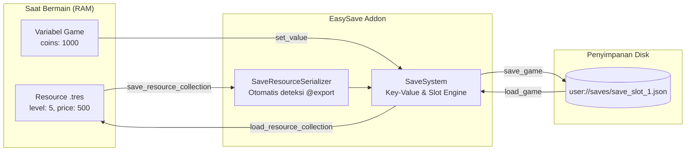

# 📖 Dokumentasi Resmi EasySave (Godot 4.x)

Selamat datang di dokumentasi **EasySave**! Addon ini dirancang dengan standar Godot 4.x untuk menyederhanakan proses penyimpanan dan pemuatan data game, khususnya penyelesaian masalah klasik: **menyimpan dan memulihkan custom `Resource` (`.tres`) tanpa perlu menulis kode manual berulang kali**.

---

## 📑 Daftar Isi
1. [Konsep Dasar: Mengapa Menyimpan Resource di Godot Sering Membingungkan?](#1-konsep-dasar-mengapa-menyimpan-resource-di-godot-sering-membingungkan)
2. [Instalasi & Aktivasi](#2-instalasi--aktivasi)
3. [Panduan Lengkap: Cara Menyimpan & Memuat Resource](#3-panduan-lengkap-cara-menyimpan--memuat-resource)
   - [Studi Kasus 1: Resource Tunggal (Single Resource)](#studi-kasus-1-resource-tunggal-single-resource)
   - [Studi Kasus 2: Kumpulan Resource (Array of Resources / Database)](#studi-kasus-2-kumpulan-resource-array-of-resources--database)
4. [Panduan Key-Value: Menyimpan Variabel Bebas](#4-panduan-key-value-menyimpan-variabel-bebas)
5. [Manajemen Slot & Menu Simpan/Muat](#5-manajemen-slot--menu-simpanmuat)
6. [Fitur Autosave](#6-fitur-autosave)
7. [Menyimpan Status Node di Scene Tree](#7-menyimpan-status-node-di-scene-tree)
8. [Referensi Class (API Reference)](#8-referensi-class-api-reference)
   - [Class: SaveSystem](#class-savesystem)
   - [Class: SaveResourceSerializer](#class-saveresourceserializer)
9. [FAQ & Solusi Masalah Umum](#9-faq--solusi-masalah-umum)

---

## 1. Konsep Dasar: Mengapa Menyimpan Resource di Godot Sering Membingungkan?

### Masalah pada Godot Biasa:
1. **Resource (`.tres`) adalah file aset di `res://`:**
   Saat game dijalankan, file di `res://` bersifat *read-only* setelah game diekspor/dirilis. Kamu tidak boleh dan tidak bisa menyimpan progres pemain langsung menimpa file `.tres` bawaan di `res://`.
2. **Resource di-cache di memori (*In-Memory Cache*):**
   Jika kamu mengubah variabel di dalam Resource saat bermain (misal `current_level += 1`), perubahan tersebut menempel di memori RAM. Jika pemain kembali ke Main Menu dan membuat Save Slot Baru, Resource tersebut masih membawa nilai dari slot sebelumnya jika tidak di-reload secara bersih!
3. **Boilerplate yang Melelahkan:**
   Sebelum ada EasySave, setiap kali kamu membuat Resource baru (seperti `UpgradeData`, `Skill`, `Item`, atau `Mission`), kamu terpaksa membuka `SaveManager`, membuat fungsi looping manual, mengonversi data satu per satu ke Dictionary, dan menulis fungsi load manual.

### Bagaimana EasySave Bekerja?



EasySave bekerja dengan cara:
1. **Membaca property yang berubah** dari Resource kamu secara otomatis menggunakan refleksi (`get_property_list()`).
2. **Menyimpannya ke file JSON** di folder pemain (`user://saves/save_slot_X.json`).
3. Saat di-load, EasySave **memulihkan kembali** nilai-nilai tersebut ke dalam Resource. Jika Resource belum pernah disimpan (misal slot baru), EasySave **otomatis mengembalikan ke nilai default bersih dari file aslinya** (`CACHE_MODE_IGNORE`).

---

## 2. Instalasi & Aktivasi

1. Salin folder `addons/easy_save/` ke dalam folder `addons/` di project Godot kamu:
   ```text
   res://
   └── addons/
       └── easy_save/
           ├── plugin.cfg
           ├── plugin.gd
           ├── save_system.gd
           ├── save_serializer.gd
           └── README.md
   ```
2. Di editor Godot, buka: **Project** -> **Project Settings** -> tab **Plugins**.
3. Cari **EasySave**, lalu centang kotak **Enable**.
4. Selesai! Singleton **`SaveSystem`** sekarang aktif secara global dan dapat dipanggil dari skrip mana pun.

---

## 3. Panduan Lengkap: Cara Menyimpan & Memuat Resource

Ada 2 cara penggunaan Resource di dalam game:
* **Kasus A: Single Resource** (Hanya 1 file Resource tunggal, misal: `PlayerStats.tres` atau `GameSettings.tres`).
* **Kasus B: Resource Collection / Database** (Banyak Resource di dalam Array, misal: daftar upgrade, daftar skill, daftar wilayah, inventory).

---

### Studi Kasus 1: Resource Tunggal (Single Resource)

Misalkan kamu membuat custom resource untuk menyimpan statistik pemain:

```gdscript
# res://scripts/player_stats_data.gd
class_name PlayerStatsData
extends Resource

@export var player_name: String = "Pahlawan"
@export var max_health: int = 100
@export var attack_power: float = 15.0
@export var current_position: Vector3 = Vector3.ZERO
```

Kamu memiliki file asetnya: `res://resources/player_stats.tres`.

#### 💾 Cara Menyimpan:
```gdscript
# Ambil referensi resource kamu
@export var stats: PlayerStatsData

func simpan_progress() -> void:
    # 1. Simpan objek resource ke SaveSystem
    SaveSystem.save_resource("player_stats", stats)
    
    # 2. Tulis ke file disk slot aktif
    SaveSystem.save_game()
```

#### 📂 Cara Memuat Kembali:
```gdscript
@export var stats: PlayerStatsData

func muat_progress() -> void:
    # 1. Baca data slot dari disk
    SaveSystem.load_game()
    
    # 2. Pulihkan nilai-nilainya ke dalam resource kamu
    SaveSystem.load_resource("player_stats", stats)
    
    print("Health sekarang:", stats.max_health)
    print("Posisi:", stats.current_position)
```

---

### Studi Kasus 2: Kumpulan Resource (Array of Resources / Database)

> [!IMPORTANT]
> **Ini adalah solusi untuk masalah utama kamu!**
> Di game seperti *Sawit-io*, kamu memiliki database yang berisi banyak Resource (`upgrades: Array[UpgradeData]`, `skills: Array[skill]`, atau `missions: Array[Mission]`).

Misalkan kamu punya Resource `UpgradeData.gd`:
```gdscript
class_name UpgradeData
extends Resource

@export var upgrade_name: String = "Pohon Sawit"
@export var current_level: int = 0
@export var price: float = 100.0
@export var price_multiplier: float = 1.3
```

Dan kamu punya Resource database yang menampung array tersebut:
```gdscript
class_name UpgradeDatabase
extends Resource

@export var upgrades: Array[UpgradeData] = []
```

#### 💾 Cara Menyimpan Koleksi Resource:
Kamu **TIDAK PERLU** membuat fungsi looping atau dictionary manual! Cukup gunakan `save_resource_collection`:

```gdscript
@export var database: UpgradeDatabase

func simpan_semua_upgrade() -> void:
    # Parameter fungsi:
    # 1. key (String): Nama kategori penyimpanan di file JSON (bebas, misal: "upgrades").
    # 2. resources (Array): Array yang berisi objek-objek Resource kamu.
    # 3. id_property (String): Nama variabel di Resource yang menjadi KTP / ID uniknya!
    # 4. properties_to_save (PackedStringArray, OPSIONAL): Variabel apa saja yang mau disimpan.
    #    Jika dikosongkan ([]), semua variabel @export akan otomatis disimpan!
    
    SaveSystem.save_resource_collection(
        "daftar_upgrade", 
        database.upgrades, 
        "upgrade_name", 
        ["current_level", "price"]
    )
    
    # Jangan lupa panggil save_game() untuk menulis ke disk
    SaveSystem.save_game()
```

#### 📂 Cara Memuat Kembali Koleksi Resource:

```gdscript
@export var database: UpgradeDatabase

func muat_semua_upgrade() -> void:
    # 1. Muat data dari file disk
    SaveSystem.load_game()
    
    # 2. Kembalikan nilainya ke objek database
    SaveSystem.load_resource_collection(
        "daftar_upgrade", 
        database.upgrades, 
        "upgrade_name"
    )
    
    print("Semua upgrade berhasil dipulihkan sesuai level tersimpan!")
```

#### 🔍 Penjelasan Parameter:
* **`id_property`:** Ini adalah nama variabel pembeda.
  * Pada `UpgradeData`, pengenalnya adalah `"upgrade_name"`.
  * Pada `Skill`, pengenalnya adalah `"id"`.
  * Pada `Wilayah`, pengenalnya adalah `"id_wilayah"`.
* **`properties_to_save` (Opsional):**
  * Jika kamu hanya ingin menyimpan level dan harga: `["current_level", "price"]`.
  * Jika kamu isi array kosong `[]`: EasySave akan otomatis mendeteksi dan menyimpan **seluruh variabel `@export`** yang bukan aset statis (tekstur/audio/mesh otomatis diabaikan).
* **Fitur Anti-Bocor (*Clean Fallback*):**
  Jika seorang pemain membuat Save Slot Baru, Resource yang belum ada di save data akan **otomatis di-reset ke nilai bawaan file `.tres`-nya**. Nilai dari save slot sebelumnya tidak akan pernah bocor!

---

## 4. Panduan Key-Value: Menyimpan Variabel Bebas

Selain Resource, kamu tentu punya variabel biasa seperti jumlah koin, skor tertinggi, atau koordinat kamera. Gunakan sistem **Key-Value**:

```gdscript
# ==========================================
# MENYIMPAN VARIABEL
# ==========================================
SaveSystem.set_value("coins", 5000)
SaveSystem.set_value("player_name", "Budi")
SaveSystem.set_value("is_hardcore", true)
SaveSystem.set_value("camera_zoom", 1.4)
# Tipe Vector2, Vector3, Color otomatis dikonversi dengan aman:
SaveSystem.set_value("spawn_point", Vector3(12.5, 0.0, -8.2))

# Commit ke disk
SaveSystem.save_game()


# ==========================================
# MEMUAT VARIABEL
# ==========================================
SaveSystem.load_game()

# get_value(kunci, nilai_default_jika_belum_ada)
var coins: int = int(SaveSystem.get_value("coins", 0))
var player_name: String = str(SaveSystem.get_value("player_name", "Pemain"))
var is_hardcore: bool = bool(SaveSystem.get_value("is_hardcore", false))
var spawn: Vector3 = SaveSystem.get_value("spawn_point", Vector3.ZERO)
```

---

## 5. Manajemen Slot & Menu Simpan/Muat

EasySave memiliki sistem manajemen slot bawaan yang memisahkan file tiap slot:
Format default: `user://saves/save_slot_1.json`, `user://saves/save_slot_2.json`, dst.

### Alur Kerja di Main Menu (Pilih / Buat Slot):

```gdscript
# 1. Mendapatkan daftar semua slot yang sudah pernah dibuat
var used_slots: Array[int] = SaveSystem.get_all_used_slots()
print("Slot yang ada:", used_slots) # Contoh: [1, 2, 4]

# 2. Mengetahui nomor slot kosong berikutnya untuk tombol "New Game"
var next_slot: int = SaveSystem.get_next_available_slot()

# 3. Membuat slot baru
SaveSystem.create_slot(next_slot, "Save Petualangan")

# 4. Membaca metadata slot untuk ditampilkan di UI kartu slot tanpa memuat seluruh isi game
var info: Dictionary = SaveSystem.get_slot_metadata(next_slot)
print("Nama Slot:", info.get("slot_name"))
print("Terakhir Disimpan:", info.get("saved_date_str"))

# 5. Memilih slot aktif dan masuk gameplay
SaveSystem.set_slot(next_slot)
SaveSystem.load_game()
get_tree().change_scene_to_file("res://scenes/gameplay.tscn")
```

### Menghapus Slot:
```gdscript
# Menghapus slot nomor 2
SaveSystem.delete_slot(2)

# Atau hapus semua save file
SaveSystem.delete_all_slots()
```

---

## 6. Fitur Autosave

EasySave memiliki timer autosave internal sehingga kamu tidak perlu membuat node `Timer` manual di setiap scene.

```gdscript
# Mengaktifkan autosave berkala (misal tiap 30 detik)
SaveSystem.set_autosave_interval(30.0)
SaveSystem.set_autosave_enabled(true)

# Mematikan autosave (misal saat pemain berada di Main Menu atau Pause Menu)
SaveSystem.set_autosave_enabled(false)
```

Kamu juga bisa mendengarkan sinyal saat autosave terjadi untuk memunculkan ikon animasi di UI:

```gdscript
func _ready() -> void:
    SaveSystem.autosaved.connect(_on_autosaved)

func _on_autosaved(slot: int) -> void:
    print("Game berhasil di-autosave pada slot:", slot)
    $SaveIndicatorIcon.play("fade_in_out")
```

---

## 7. Menyimpan Status Node di Scene Tree

Jika kamu memiliki banyak objek interaktif di level (seperti Peti Harta, Pintu, Musuh) dan ingin mereka menyimpan statusnya sendiri:

1. Masukkan node tersebut ke group `"saveable"`.
2. Di dalam skrip node tersebut, buat 2 fungsi standar ini:

```gdscript
# chest.gd
extends Node3D

var is_opened: bool = false

func get_save_data() -> Dictionary:
    return {
        "is_opened": is_opened
    }

func load_save_data(data: Dictionary) -> void:
    is_opened = bool(data.get("is_opened", false))
    if is_opened:
        $AnimationPlayer.play("open_instant")
```

3. Di skrip level atau manager kamu, cukup panggil:
```gdscript
# Simpan semua node di group "saveable"
SaveSystem.save_nodes_in_group("saveable")
SaveSystem.save_game()

# Muat kembali
SaveSystem.load_nodes_in_group("saveable")
```

---

## 8. Referensi Class (API Reference)

### Class: `SaveSystem`
*Inherits:* `Node`  
*Autoload Singleton:* `SaveSystem`

> [!NOTE]
> `SaveSystem` terdaftar sebagai **Autoload Singleton** murni di SceneTree project kamu. Kamu dapat memanggil fungsinya secara langsung dari skrip mana pun tanpa perlu instansiasi manual (`SaveSystem.set_value()`, `SaveSystem.save_game()`, dsb). Hal ini juga mencegah konflik nama kelas global (*class name collision*) di Godot 4.

#### Sinyal:
* `save_started(slot: int)` — Dipancarkan sesaat sebelum proses penulisan file save dimulai.
* `save_completed(slot: int)` — Dipancarkan setelah data berhasil ditulis ke disk.
* `load_started(slot: int)` — Dipancarkan sesaat sebelum membaca file dari disk.
* `load_completed(slot: int)` — Dipancarkan setelah data berhasil dimuat ke memori aktif.
* `slot_changed(new_slot: int, old_slot: int)` — Dipancarkan saat `set_slot()` dipanggil.
* `slot_created(slot: int)` — Dipancarkan saat slot baru dibuat.
* `slot_deleted(slot: int)` — Dipancarkan saat sebuah slot dihapus.
* `autosaved(slot: int)` — Dipancarkan saat timer autosave berhasil menyimpan game.

#### Metode Utama:

| Fungsi | Tipe Return | Deskripsi |
| :--- | :--- | :--- |
| `set_slot(slot: int)` | `void` | Memilih nomor slot aktif (1, 2, dst). |
| `get_slot()` | `int` | Mengembalikan nomor slot aktif saat ini (-1 jika belum ada). |
| `clear_active_slot()` | `void` | Mengosongkan pilihan slot aktif dan mematikan timer autosave. |
| `slot_exists(slot: int)` | `bool` | Memeriksa apakah file slot tertentu sudah ada di disk. |
| `get_all_used_slots()` | `Array[int]` | Mengembalikan daftar array semua nomor slot yang tersimpan di disk. |
| `get_next_available_slot()` | `int` | Mencari nomor slot terkecil yang masih kosong untuk save baru. |
| `create_slot(slot: int, slot_name: String = "", initial_data: Dictionary = {})` | `bool` | Membuat file slot baru beserta metadata awalnya. |
| `delete_slot(slot: int)` | `bool` | Menghapus file slot tertentu dari disk. |
| `save_game()` | `bool` | Menulis seluruh data dan metadata aktif saat ini ke disk. |
| `load_game()` | `bool` | Membaca file slot aktif dari disk ke memori aktif. |
| `set_value(key: String, value: Variant)` | `void` | Menyimpan variabel bebas dengan kunci tertentu. |
| `get_value(key: String, default: Variant = null)` | `Variant` | Mengambil variabel bebas dari memori aktif. |
| `save_resource(key: String, resource: Resource, properties: PackedStringArray = [])` | `void` | Menyimpan 1 Resource tunggal ke data aktif. |
| `load_resource(key: String, resource: Resource)` | `void` | Memulihkan 1 Resource tunggal dari data aktif. |
| `save_resource_collection(key: String, resources: Array, id_property: String = "id", properties: PackedStringArray = [])` | `void` | Menyimpan array of Resource secara otomatis berdasarkan property pengenal ID-nya. |
| `load_resource_collection(key: String, resources: Array, id_property: String = "id", reset_clean_fallback: bool = true)` | `void` | Memulihkan array of Resource dari data aktif. |
| `set_autosave_enabled(enabled: bool)` | `void` | Mengaktifkan/menonaktifkan timer auto-save. |

---

### Class: `SaveResourceSerializer`
*Inherits:* `RefCounted`

Utility class independen yang berisi fungsi-fungsi statis untuk konversi data Resource Godot ke Dictionary JSON:

* `static func serialize_resource(resource: Resource, properties_to_save: PackedStringArray = [], properties_to_exclude: PackedStringArray = []) -> Dictionary`
* `static func deserialize_resource(resource: Resource, data: Dictionary) -> void`
* `static func serialize_resource_collection(resources: Array, id_property: String = "id", properties_to_save: PackedStringArray = [], properties_to_exclude: PackedStringArray = []) -> Dictionary`
* `static func deserialize_resource_collection(resources: Array, saved_data: Dictionary, id_property: String = "id", reset_clean_fallback: bool = true) -> void`
* `static func encode_variant(value: Variant) -> Variant`
* `static func decode_variant(value: Variant) -> Variant`

---

## 9. FAQ & Solusi Masalah Umum

### Q: Kenapa saya tidak boleh langsung menyimpan file `.tres` dengan `ResourceSaver.save()` saat gameplay?
**A:** Karena di game yang sudah diekspor (menjadi `.exe`, `.apk`, dsb), folder `res://` di-pack menjadi file binary read-only. File save pemain harus disimpan di `user://` (folder data pengguna di OS). EasySave otomatis mengelola penyimpanan di `user://saves/` dalam format JSON yang aman dan fleksibel.

### Q: Bagaimana jika saya menambah Resource baru di kemudian hari (misal `MissionData`)?
**A:** Kamu **TIDAK PERLU** mengutak-atik kode `SaveSystem`! Cukup panggil:
```gdscript
SaveSystem.save_resource_collection("missions", mission_db.missions, "id")
SaveSystem.load_resource_collection("missions", mission_db.missions, "id")
```
Itu saja! Addon langsung otomatis mengenali dan menyimpannya.

### Q: Apakah file save bisa dienkripsi agar pemain tidak bisa mengedit uang/level lewat notepad?
**A:** Bisa! Buka Inspector pada Project Settings atau atur di skrip:
```gdscript
SaveSystem.encryption_password = "password_rahasia_kamu"
```
Jika diisi, file JSON akan dienkripsi secara otomatis menggunakan algoritma enkripsi bawaan Godot (`FileAccess.open_encrypted_with_pass`).

### Q: Di mana letak file save di komputer saya?
**A:** Sesuai standar Godot untuk `user://`:
* **Windows:** `%APPDATA%\Godot\app_userdata\[Nama_Project]\saves\`
* **Linux:** `~/.local/share/godot/app_userdata/[Nama_Project]/saves/`
* **macOS:** `~/Library/Application Support/Godot/app_userdata/[Nama_Project]/saves/`

### Q: Mengapa saat mengaktifkan plugin EasySave tidak terjadi pesan bentrok "collide with an existing global script class name"?
**A:** Karena skrip `save_system.gd` tidak menggunakan deklarasi `class_name SaveSystem`, melainkan murni didaftarkan sebagai Autoload Singleton bernama `SaveSystem`. Dengan demikian, Godot 4 dapat mendaftarkan nama `SaveSystem` secara bersih ke dalam SceneTree tanpa bentrok nama kelas, dan kamu bisa memanggil seluruh metodenya secara langsung (`SaveSystem.set_slot()`, `SaveSystem.get_value()`, `SaveSystem.save_game()`).
